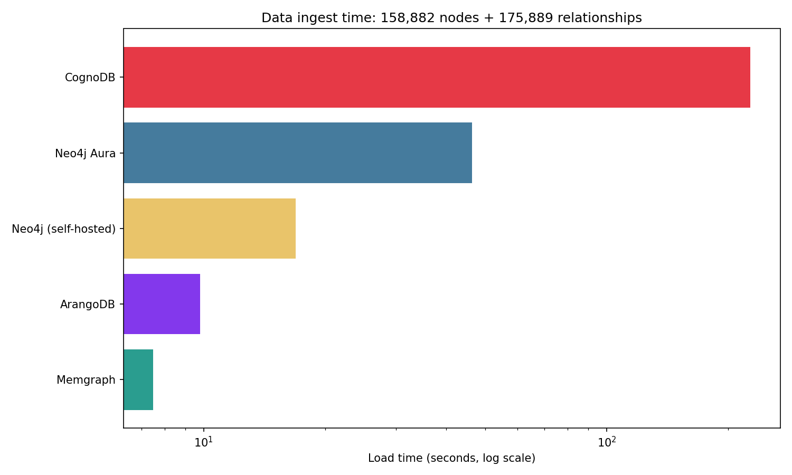
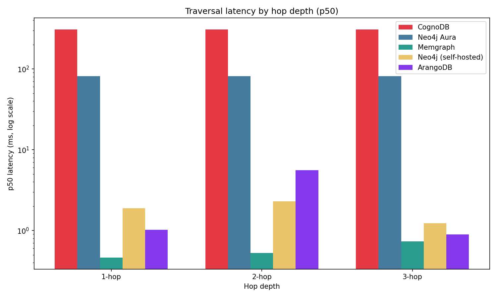
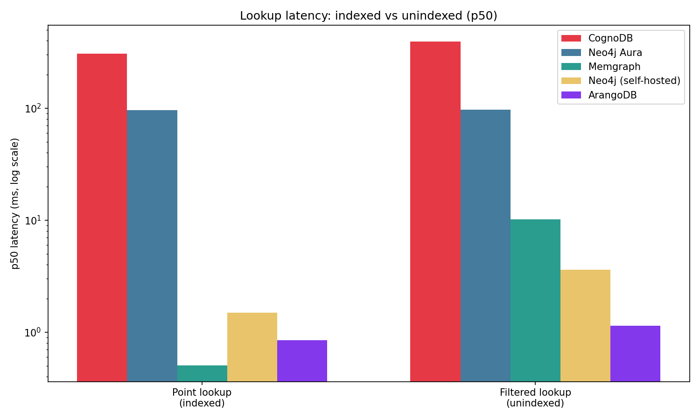
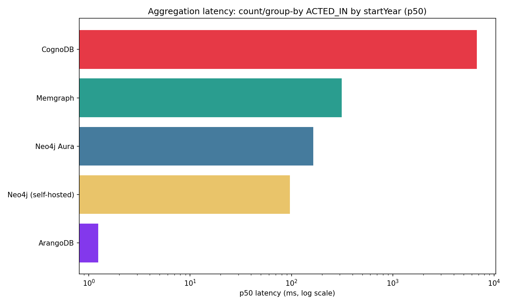
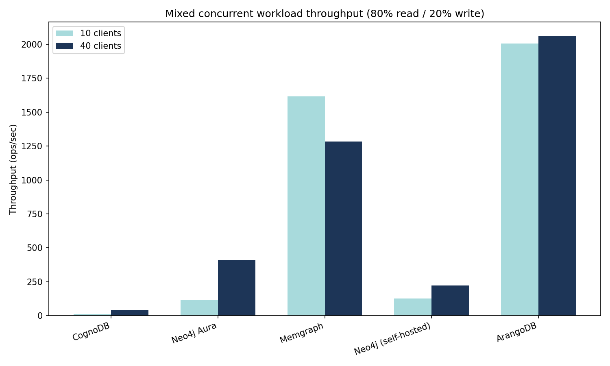

# CognoDB Cloud Benchmark — Graph Database Comparison

A reproducible benchmark comparing **CognoDB Cloud** against four other graph database platforms — **Neo4j AuraDB Free**, **self-hosted Neo4j**, **Memgraph**, and **ArangoDB** — on identical data, identical queries, and matched resource limits.

This benchmark does not declare a "winner." The goal is fair methodology, reproducible automation, and honest reporting of where and why the platforms differ.

---

## 1. Platforms tested

| Platform               | Deployment                    | vCPU         | RAM          | Storage         | Protocol                  |
|------------------------|-------------------------------|--------------|--------------|-----------------|---------------------------|
| **CognoDB Cloud**      | Managed (Free tier, `c0`)     | burst to 0.5 | 512 MB       | 1 GiB           | Bolt (`bolt+s://`)        |
| **Neo4j AuraDB**       | Managed (Free tier)           | not published | not published | quota-based     | Bolt (`neo4j+s://`)       |
| **Neo4j (self-hosted)**| Docker, capped                | 0.5          | 512 MB (256 MB heap + 64 MB pagecache) | host disk | Bolt (`bolt://`) |
| **Memgraph**           | Docker, capped                | 0.5          | 512 MB        | host disk (in-memory) | Bolt (`bolt://`) |
| **ArangoDB**           | Docker, capped                | 0.5          | 512 MB        | host disk         | HTTP/AQL                  |

**Fairness note:** CognoDB's free tier (0.5 vCPU / 512 MB / 1 GiB) is used as the resource baseline. The three self‑hosted platforms (Neo4j, Memgraph, ArangoDB) were run in Docker containers explicitly capped with `--cpus=0.5 --memory=512m` to match. AuraDB Free does not publish its underlying vCPU/RAM allocation, so exact parity with AuraDB cannot be guaranteed or verified — this is disclosed here rather than hidden. All benchmark client code ran from the same local machine for every platform.

---

## 2. Dataset

**Source:** [IMDb Non‑Commercial Datasets](https://datasets.imdbws.com/) (`title.basics.tsv.gz`, `title.principals.tsv.gz`, `name.basics.tsv.gz`)

**Shape:** a movie–actor graph.
- `Person` nodes — actors/actresses
- `Title` nodes — movies released 2015 or later
- `ACTED_IN` relationships — Person → Title

**Final size (identical across all 5 platforms):**
- 134,208 `Person` nodes
- 24,674 `Title` nodes
- **158,882 total nodes**
- **175,889 `ACTED_IN` relationships**

This falls inside the assignment's recommended 100k–500k relationship range and comfortably clears the 100,000 relationship minimum.

**Load method:** identical CSV files (`data/nodes_people.csv`, `data/nodes_titles.csv`, `data/edges_acted_in.csv`) generated once by `prepare_dataset.py`, then loaded into each platform via its official driver using batched inserts (batch size 500). CognoDB, Aura, and self‑hosted Neo4j all use Cypher `UNWIND ... MERGE`; Memgraph uses `UNWIND ... MERGE` for nodes and `UNWIND ... CREATE` for relationships (see §6 caveats); ArangoDB uses `insert_many()` batch document inserts.

**Indexes:** `Person.personId` and `Title.titleId` are indexed/uniquely constrained on every platform (via `CREATE CONSTRAINT`/`CREATE INDEX` in the Cypher loaders, `add_persistent_index` in the ArangoDB loader). `Title.startYear` is **not indexed** on any platform — used deliberately in the lookup workload as the "unindexed filter" comparison point.

---

## 3. Methodology

- Same dataset, same logical queries, same client machine for every platform.
- Each read workload: **15 warmup iterations** (discarded) + **100 timed iterations**, reporting p50 and p95 latency in milliseconds.
- Mixed workload: concurrency sweep at **10 and 40 concurrent clients**, 15 seconds sustained load per level, 80% read / 20% write mix.
- All raw per‑iteration latencies and summary statistics are saved to `results/*.csv`.
- Every script is platform‑parameterized and reruns are one command (see §8).

---

## 4. Results



### 4.1 Data loading (ingest throughput)

| Platform           | Load time | Notes |
|--------------------|----------:|-------|
| ArangoDB           | 9.8s      | `insert_many()` batch writes, `waitForSync=false` (default) |
| Memgraph           | 7.5s*     | see caveat below — original run took 16,547s |
| Self‑hosted Neo4j  | 16.9s     | |
| Neo4j AuraDB       | 46.3s     | remote, network round‑trip per batch |
| CognoDB            | 227.0s    | remote, network round‑trip per batch |

\* **Caveat:** Memgraph's first load attempt took **16,547 seconds (~4.6 hours)** using `MERGE` for the `ACTED_IN` relationship, which performs an existence check before creating each edge. Under the 0.5 vCPU cap this existence check compounded catastrophically across 175,889 edges. Since the load targets an empty graph (no duplicate risk), the relationship write was switched from `MERGE` to `CREATE`, which skips the existence check. The corrected load completed in 7.5s. Both numbers are reported here for transparency; **7.5s is the number used in all further comparisons.**

### 4.2 Traversal latency (1‑hop / 2‑hop / 3‑hop, ms)



| Platform               | 1‑hop p50 | 1‑hop p95 | 2‑hop p50 | 2‑hop p95 | 3‑hop p50 | 3‑hop p95 |
|------------------------|----------:|----------:|----------:|----------:|----------:|----------:|
| Memgraph               | 0.38      | 0.78      | 0.45      | 0.79      | 0.42      | 0.85      |
| ArangoDB               | 0.85      | 1.00      | 1.13      | 2.05      | 1.39      | 2.47      |
| Neo4j (self‑hosted)    | 2.88      | 75.85     | 3.11      | 77.41     | 2.04      | 73.85     |
| Neo4j AuraDB           | 85.89     | 87.92     | 85.77     | 87.08     | 85.87     | 87.10     |
| CognoDB                | 291.82    | 358.22    | 292.78    | 338.84    | 305.98    | 342.68    |

### 4.3 Lookup latency (point lookup / filtered lookup, ms)



| Platform               | Point p50 | Point p95 | Filtered p50 | Filtered p95 |
|------------------------|----------:|----------:|-------------:|-------------:|
| Memgraph               | 0.38      | 0.57      | 10.19        | 60.80        |
| ArangoDB               | 1.02      | 1.31      | 1.56         | 6.58         |
| Neo4j (self‑hosted)    | 2.38      | 69.58     | 4.51         | 83.46        |
| Neo4j AuraDB           | 85.31     | 86.61     | 86.01        | 92.38        |
| CognoDB                | 281.93    | 372.72    | 305.25       | 355.95       |

Point lookup filters on the indexed `personId`. Filtered lookup filters on the unindexed `startYear` — the cost of the missing index is visible most clearly on Memgraph (0.38ms → 10.19ms p50) since its otherwise very low baseline latency makes the scan cost stand out.

### 4.4 Aggregation latency (count/group‑by `ACTED_IN` by `Title.startYear`, ms)



| Platform               | p50     | p95     |
|------------------------|--------:|--------:|
| Neo4j (self‑hosted)    | 92.35   | 182.37  |
| Memgraph               | 116.31  | 182.46  |
| Neo4j AuraDB           | 148.14  | 159.81  |
| ArangoDB               | 1216.35 | 1282.40 |
| CognoDB                | 1822.60 | 1953.98 |

**Caveat:** ArangoDB's aggregation query resolves each edge's target document individually via `DOCUMENT(e._to)` inside a `FOR` loop over all 175,889 edges — an N+1‑style per‑edge resolution. Cypher's `MATCH (p)-[:ACTED_IN]->(t)` performs the equivalent join as a single native graph traversal. This is a query‑construction/paradigm difference between AQL and Cypher for this specific query shape, not a resource or hardware difference — it explains why ArangoDB (fastest on traversal/lookup) is much slower here.

### 4.5 Mixed concurrent workload (80% read / 20% write, ops/sec)



| Platform               | 10 clients (ops/sec, errors) | 40 clients (ops/sec, errors) |
|------------------------|-----------------------------:|-----------------------------:|
| ArangoDB               | 2211.9, 0                   | 2119.9, 1713                |
| Memgraph               | 1455.3, 0                   | 1378.3, 1008                |
| Neo4j AuraDB           | 113.9, 0                    | 400.5, 273                  |
| Neo4j (self‑hosted)    | 78.5, 0                     | 129.6, 10                   |
| CognoDB                | 31.9, 0                     | 83.5, 73                    |

Every platform shows **zero errors at 10 concurrent clients** and **non‑zero errors at 40** — consistent with the shared 0.5 vCPU cap becoming a real contention point once concurrency exceeds what half a core can service without queuing/timeout failures. Local platforms (ArangoDB, Memgraph) show flat or slightly declining throughput from 10→40 clients, consistent with a CPU‑bound bottleneck. Remote platforms (Aura, self‑hosted Neo4j) show throughput *increasing* from 10→40 despite errors, consistent with a network‑latency‑bound bottleneck where more in‑flight requests still help overall utilization.

### 4.6 Resource footprint

| Platform               | Storage/footprint | Source |
|------------------------|------------------:|--------|
| CognoDB                | 128 MB            | Console UI |
| Neo4j (self‑hosted)    | 539 MB (disk)     | `docker exec neo4j-selfhosted du -sh /data` |
| Memgraph               | 488 MB (in‑memory snapshot, ~95% of 512 MB cap) | `docker exec memgraph du -sh /var/lib/memgraph` |
| ArangoDB               | 137.4 MB (disk)   | `docker exec arangodb du -sh /var/lib/arangodb3` |
| Neo4j AuraDB           | **Not observable.** AuraDB Free gates CPU/storage/query‑rate metrics behind a paid "Professional" upgrade. Only quota‑based counts are shown: 158,882 nodes (79% of quota), 175,889 relationships (44% of quota). | Console UI |

---

## 5. Analysis

**Local vs. remote dominates every latency result.** All three self‑hosted platforms (Memgraph, ArangoDB, self‑hosted Neo4j) post sub‑3ms p50 latency on point queries; both managed remote platforms (Aura, CognoDB) sit at 80‑300ms+ regardless of query complexity. For point‑style queries, network round‑trip time to the managed instance is the dominant cost, not the query engine itself — traversal depth (1‑hop vs 3‑hop) barely moves the needle for Aura or CognoDB, while it visibly does for the fast local engines.

**CognoDB is consistently ~3× slower than Aura despite both being remote.** CognoDB's instance region was `us-east4`; exact network path/region distance from the benchmark client likely explains a meaningful part of this gap. This is reported as an open question rather than a conclusion — pinning down the exact cause would need a same‑region comparison, out of scope here.

**Self‑hosted Neo4j's p95 tail is disproportionately large relative to its p50** (e.g. 2.88ms p50 vs 75.85ms p95 on 1‑hop traversal) — a ~26× spread. This pattern repeats across traversal and lookup workloads and is worth flagging as a genuine anomaly rather than smoothing over: possible causes include JVM GC pauses (a known Neo4j characteristic under tight heap limits) or Docker CPU‑throttling stalls under the 0.5 vCPU cap. Memgraph and ArangoDB, both non‑JVM, show far tighter p50/p95 spreads throughout.

**Query paradigm, not just hardware, explains ArangoDB's aggregation result.** ArangoDB is the fastest platform on traversal and lookup but by far the slowest local platform on aggregation, due to how the AQL query was written (per‑edge `DOCUMENT()` resolution vs. Cypher's native pattern match) — see §4.4. This is a useful reminder that "platform X is faster" claims are query‑shape‑dependent, not a single number.

**All platforms show a real concurrency ceiling at 40 clients under the 0.5 vCPU cap.** No platform sustained zero errors at 40 concurrent clients. This is presented as a genuine finding about free‑tier/capped‑resource viability under load, not a bug in any platform.

---

## 6. Caveats (full list)

- **Memgraph load time bug:** original loader used `MERGE` for relationship creation, causing a 16,547s load under the 0.5 vCPU cap. Fixed by switching to `CREATE` (safe since the load targets an empty graph). See §4.1.
- **AuraDB Free resource specs are not published by Neo4j** — exact vCPU/RAM parity with the other four platforms cannot be verified, only assumed from the "Free tier" tier name.
- **AuraDB Free storage/CPU metrics are not observable** — gated behind a paid upgrade. Reported as "not observable" per assignment guidance instead of guessing.
- **ArangoDB's `insert_many()` uses `waitForSync=false`** (the default) — writes are acknowledged once accepted, not once fsynced to disk. This likely contributes to ArangoDB's fast load time and is disclosed rather than presented as a like‑for‑like durability comparison.
- **Query paradigm differences (Cypher vs. AQL)** mean traversal/lookup/aggregation queries are logically equivalent but not always executed via identical query plans — see §4.4 for the clearest example.
- **Self‑hosted Neo4j's minimum viable memory footprint required explicit tuning** (`heap.max_size=256m`, `pagecache.size=64m`) to fit inside the 512 MB container cap — Neo4j 5's defaults exceed 512 MB and fail to start without this override.
- **Network variance:** all remote‑platform numbers (CognoDB, Aura) reflect a single benchmark client's network path and were not repeated across multiple times of day or geographic locations.

---

## 7. Repository structure
cognodb-benchmark/
├── data/ # generated dataset CSVs (not committed, see below)
├── loaders/ # cognodb_loader.py, neo4j_aura_loader.py,
│ neo4j_selfhosted_loader.py, memgraph_loader.py,
│ arango_loader.py
├── workloads/ # traversal / lookup / aggregation / mixed_concurrent
│ (Cypher versions + separate AQL versions for ArangoDB)
├── results/ # raw + summary CSVs from every workload run
├── prepare_dataset.py # downloads + filters IMDb data into data/.csv
├── setup_docker.sh # starts Memgraph/ArangoDB/Neo4j Docker containers
├── load_all.sh # loads dataset into all 5 platforms
├── run_all.sh # runs all workloads + generates charts (one command)
├── generate_charts.py # produces results/charts/.png from results/*.csv
├── test_connections.py # sanity‑checks connectivity to all 5 platforms
├── requirements.txt
├── .env.example # credential template (copy to .env, fill in, never commit)
└── README.md


`data/raw/*.tsv.gz` and `data/*.csv` are gitignored (regenerable via `prepare_dataset.py`, and large). `results/*.csv` are gitignored by default but the actual result files produced for this submission are included separately so the numbers above can be verified without a full rerun.

---

## 8. Reproducing this benchmark

### Prerequisites

- Python 3.10+
- Docker
- Git
- Free‑tier CognoDB account
- Free‑tier Neo4j AuraDB account

### Clone and create the virtual environment

```bash
git clone <this-repo-url>
cd cognodb-benchmark

python3 -m venv venv
source venv/bin/activate
